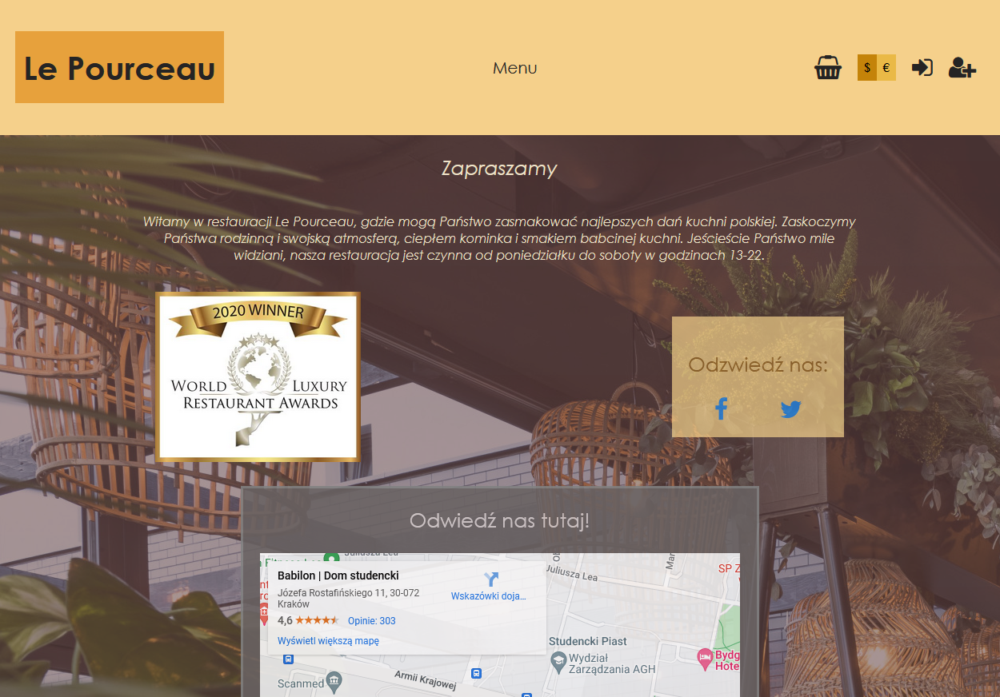
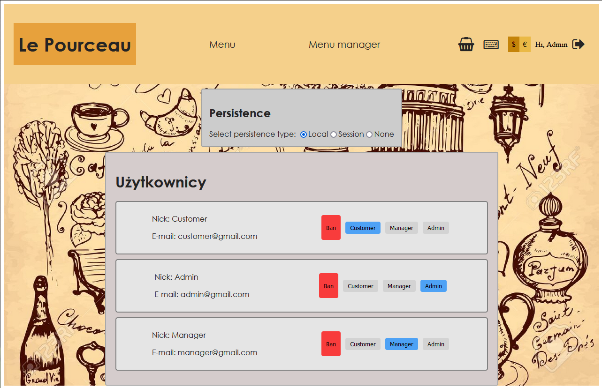

# Strona restauracji

## Prospekt
Projekt powstał w ramach przedmiotu Wprowadzenie do Aplikacji Internetowych na 
kierunku Informatyka AGH.
Jego celem było stworzenie strony internetowej restauracji z możliwością zakupów online oraz
innych zaimplementowanie jej podstawowych funkcjonalności (rejestracja i logowanie, 
ocenianie dań, zostawianie komentarzy). Oprócz tego należało stworzyć funkcjonalności 
zarządzania stroną oraz ofertą restauracji dla admina i managerów strony - dodawanie 
oraz usuwanie dań, banowanie czy też zmiana ról zarejestrowanych użytkowników.

Projekt wykonano przy pomocy Angulara, natomiast backendem restauracji jest Google Firestore.

***UWAGA!*** _Z plików **environment.ts** oraz **environment.prod.ts**
ze względów bezpieczeństwa usunięto konfigurację Firebase'a ze względu na obecność
prywatnych kluczy. W związku z tym strona nie posiada zawartości, w przypadku
chęci wykorzystania projektu należy samodzielnie postawić bazę w Firestorze i do w/w plików
ustawić własny firebaseConfig._ 

## Funkcjonalności

#### Strona główna
Na stronie głównej znajduje się mapa Google z lokalizacją oraz linki do mediów społecznościowych.

 

#### Filtrowanie
W sekcji menu pokazane są karty dań, które możemy też sortować według kuchni, kategorii oraz ceny.
Mamy również do wyboru dwie waluty, w których pokazują się ceny. Zakres filtrowanych cech 
reaguje na zmianę filtrów oraz waluty, co przedstawiono poniżej.

 

#### Ocena dań

Jeśli jesteśmy klientem, który zakupił dane danie, mamy jednokrotną możliwość dodania
oceny w postaci gwiazdek oraz wystawienia komentarza. Po dodaniu opinii nie ma już możliwości
dodania kolejnej, to samo dotyczy się wystawienia gwiazdek. Dopóki nie zamówimy dania, te funkcjonalności
są niedostępne.

 

Na powyższej animacji możemy zauważyć, że zakup dań polega po prostu na kliknięciu jednego przycisku - 
nie implementowano przenoszenia do strony z płatnościami online, a więc i nie istnieją
statusy zamówienia (nowe, opłacone, realizowane), tylko po kliknięciu zamówienie widnieje od razu w historii
zrealizowanych (na potrzeby ocen pamiętamy, kto kupił jakie dania).

#### Edycja menu

Jako manager lub administrator strony mamy możliwość edycji pozycji w menu, jak i dodania nowych dań.
Po zalogowaniu się kontem z odpowiednimi uprawnieniami do edycji w nagłówku pojawia się sekcja Menu Manager.
Przy każdym daniu możemy je usunąć lub edytować, mamy też guziki do filtrowania i dodania nowego dania poprzez
formularz z wymaganymi polami.

 

#### Użytkownicy

Jako administrator strony mamy dostęp do specjalnego panelu (ikona klawiatury w nagłówku), który
pozwala zmieniać rolę użytkowników oraz ich banować (ban polega na zablokowaniu możliwości oceny dań).
W tym samym panelu mamy też możliwość zmiany trybu persystencji dla wszystkich użytkowników.

 

#### Inne informacje

- Zabezpieczono dostęp do ścieżek dla użytkowników bez uprawnień (guardy)
- Strona jest responsywna
- Wszystkie wykonywane operacje są przekazywane do bazy danych
